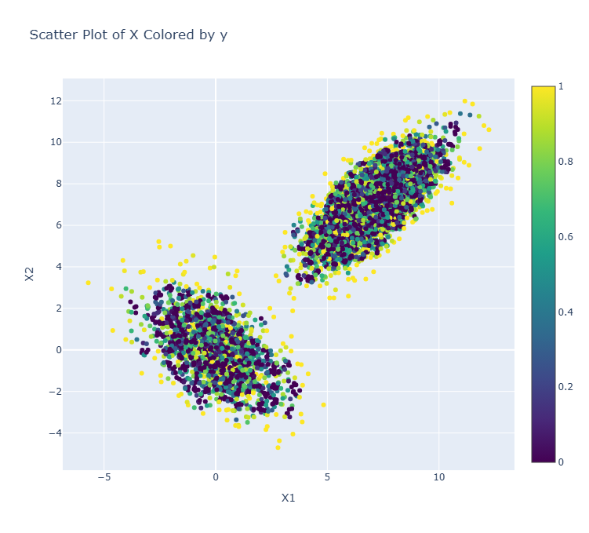

# local-outlier-probabilities

Basic Implementation of LoOP: local outlier probabilities algorithm with pure numpy.

## Introduction
Many outlier detection methods do not merely provide the decision for a single data object being or not being an outlier but give also an outlier score or "outlier factor" signaling "how much" the respective data object is an outlier. A major problem for any user not very acquainted with the outlier detection method in question is how to interpret this "factor" in order to decide for the numeric score again whether or not the data object indeed is an outlier. Here, we formulate a local density based outlier detection method providing an outlier "score" in the range of [0, 1] that is directly interpretable as a probability of a data object for being an outlier.

## Mathematical Definition
For each element $o\in D$ and neighbor S of the element, we define standard distance:
$\sigma(o, S) = \sqrt{\frac{\sum_{s \in S} d(o, s)^2}{|S|}}$

where the neighbor S is the k nearest neighbors of the element o.

We define the probabilistic set distance of o to S with significance $\lambda$ as:
$\text{pdist}(\lambda, o, S) := \lambda \cdot \sigma(o, S)$

The Probabilistic Local Outlier Factor (PLOF) of an object o is defined by:

$\text{PLOF}_{\lambda, S}(o) \\
:= \frac{\text{pdist}(\lambda, o, S(o))}{\mathbb{E}_{s \in S(o)}[\text{pdist}(\lambda, s, S(s))]} - 1$

A normalization making the scaling of PLOF independent of the particular data distribution:
$\text{nPLOF} := \lambda \cdot \sqrt{\mathbb{E}\left[(\text{PLOF})^2\right]}$

We
then apply the Gaussian Error Function to obtain a probability value, the Local Outlier Probability (LoOP), indicating the probability that a point $o\in D$ is an outlier:

$\text{LoOP}_S(o) :=\\
 \max\left\{0, \operatorname{erf}\left(\frac{\text{PLOF}_{\lambda, S}(o)}{\text{nPLOF} \cdot \sqrt{2}}\right)\right\}
$

The LoOP value will be close to 0 for points within dense regions and close to 1 for density based outliers.

## Example of the score for $\lambda=0.90$, $k_{nearest}=10$ 

